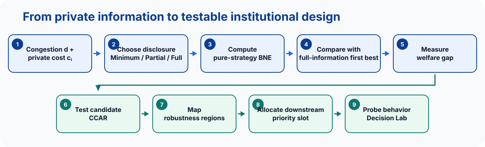
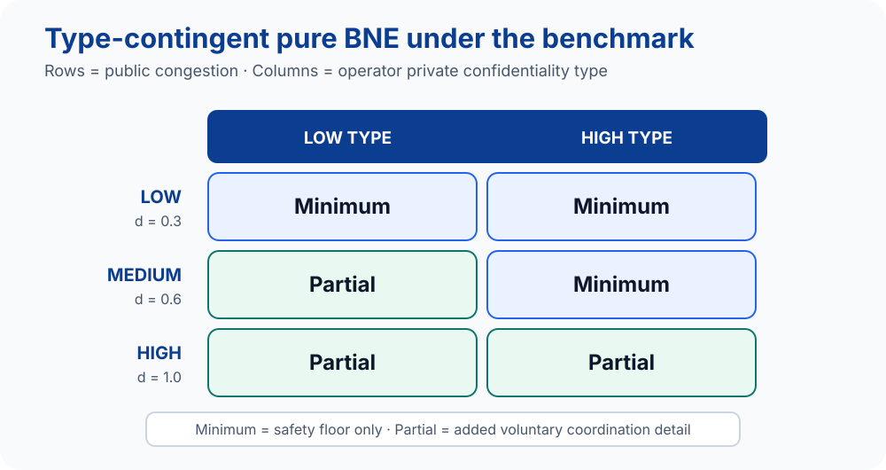
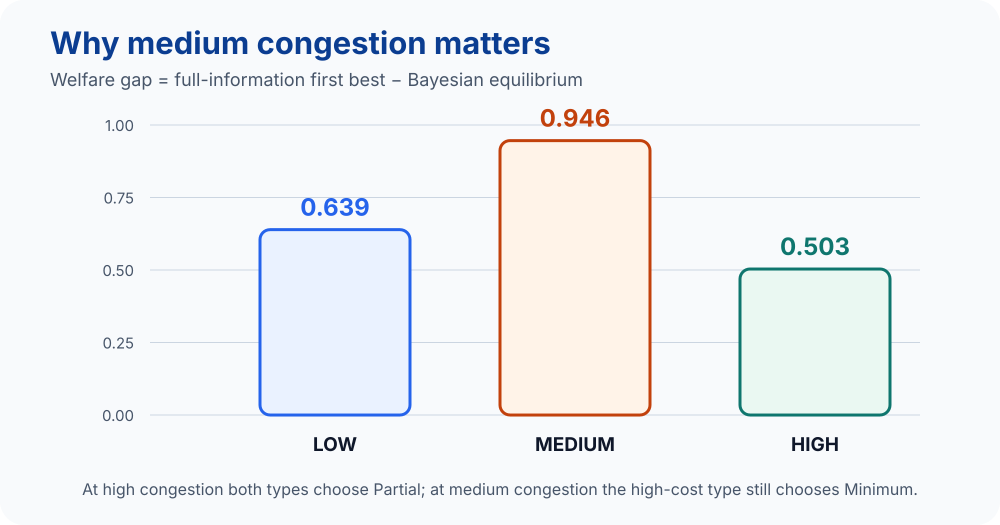
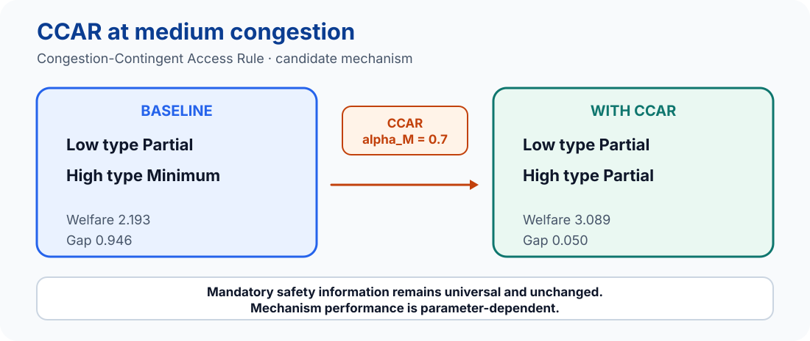
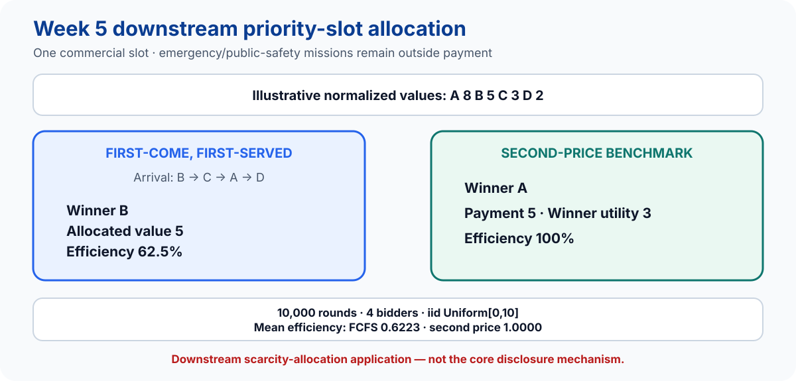
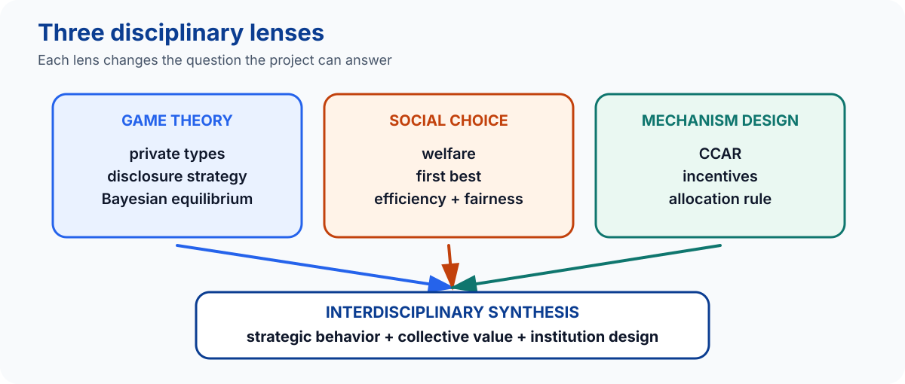
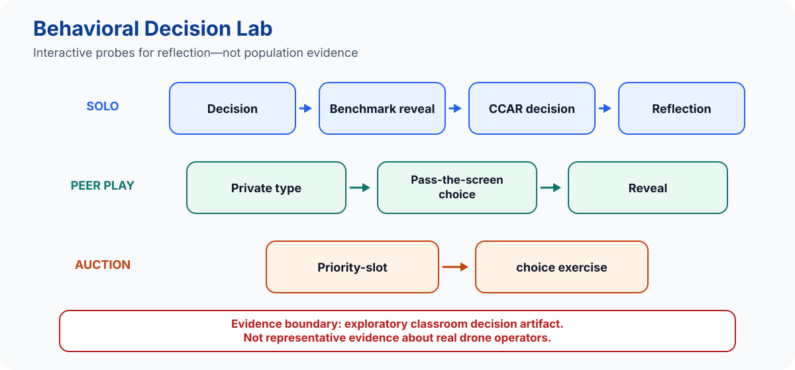

<div align="center">

# Share or Hide?

## Strategic Disclosure in Congested Low-Altitude Drone Traffic

**COMSCI/ECON 206 · Computational Microeconomics**  
Duke Kunshan University · Autumn 2026  
**FP10 · Yiqiao Liu**

*Under the stylized benchmark, disclosure rises with congestion, but the largest welfare gap appears at intermediate congestion.*

<p>
  <a href="paper/compiled/PS2-FP10-Yiqiao.pdf"></a>
  <a href="poster/PS2-FP10-Yiqiao-A0-Poster.pdf"></a>
  <a href="https://colab.research.google.com/github/dku-comsci-econ206-Autumn2026/PS2-FP10-ShareOrHide-Yiqiao/blob/main/notebooks/01_strategic_disclosure_game.ipynb"></a>
  <a href="https://colab.research.google.com/github/dku-comsci-econ206-Autumn2026/PS2-FP10-ShareOrHide-Yiqiao/blob/main/notebooks/02_priority_slot_allocation.ipynb"></a>
</p>
<p>
  <a href="https://huggingface.co/spaces/dku-comsci-econ206-2026/ps2-share-or-hide-drone-disclosure"></a>
  <a href="#reproduce-in-five-minutes"></a>
  
</p>

<sub>The test badge records the validated submission snapshot; it is not a live CI badge.</sub>

</div>

> [!IMPORTANT]
> **Stylized benchmark · largest welfare gap: MEDIUM CONGESTION**  
> Gap: **0.946** · Baseline: **Low type → Partial; High type → Minimum**  
> CCAR benchmark: **Low type → Partial; High type → Partial** · Gap: **0.946 → 0.050**

## Project pipeline

<p align="center">
  
</p>

The project begins with a Bayesian disclosure game, evaluates the social-choice loss from private incentives, tests a candidate access rule, and then carries the institutional question into a bounded downstream allocation exercise and an exploratory classroom artifact.

## Game at a glance

| Element | Definition |
|---|---|
| Players | Operator A, Operator B |
| Private type | Low / High confidentiality cost |
| Actions | Minimum / Partial / Full voluntary disclosure |
| Public state | Low / Medium / High congestion |
| Information | Own type known; rival type unknown |
| Solution concept | Pure-strategy Bayesian Nash equilibrium (BNE) |
| Welfare benchmark | Full-information first best |
| Candidate mechanism | Congestion-Contingent Access Rule (CCAR) |

| Action | Operational meaning in the model |
|---|---|
| **Minimum** | Mandatory/basic safety information only |
| **Partial** | Next sector, coarse ETA, and approximate traffic volume |
| **Full** | Richer route, timing, and trajectory information |

> [!CAUTION]
> **Mandatory safety information is never conditioned on voluntary commercial disclosure.** CCAR applies only to enhanced, non-safety coordination information.

## Main equilibrium result

<p align="center">
  
</p>

**Type-contingent pure BNE under the benchmark.** Rows are public congestion states; columns are an operator’s private confidentiality type. The labels inside every cell carry the result without relying on color. Disclosure weakly rises with congestion, but the transition is type-dependent.

## Social choice: why medium congestion matters

<p align="center">
  
</p>

At high congestion, even the high-confidentiality type voluntarily chooses Partial. At medium congestion, extra sharing is socially valuable but remains privately unattractive to that type. The benchmark welfare comparison is:

| Congestion | BNE welfare | Full-information first best | Gap |
|---|---:|---:|---:|
| Low | 0.000000 | 0.639095 | 0.639095 |
| Medium | 2.192883 | 3.139085 | 0.946202 |
| High | 6.881808 | 7.385238 | 0.503429 |

The full-information benchmark assumes that the planner observes realized types. It is a comparison benchmark, not a claim that type observability is implementable.

## Candidate mechanism: CCAR

<p align="center">
  
</p>

CCAR changes access to enhanced coordination information when an operator supplies only Minimum voluntary detail. It does not restrict mandatory safety information, and it is presented as a candidate mechanism—not as an optimal or universally successful rule.

### Robustness map

| Diagnostic | Count |
|---|---:|
| No equilibrium-set effect | 401 |
| Welfare improvement | 334 |
| Excessive-disclosure diagnostic | 18 |
| Larger welfare gap | 3 |
| Multiple pure CCAR BNE | 66 |
| No pure CCAR BNE | 0 |

<sub>760 parameter cells; diagnostic categories overlap and are not probabilities.</sub>

## Week 5 downstream allocation application

<p align="center">
  
</p>

> **Boundary:** This auction is a downstream scarcity-allocation application, not the core disclosure mechanism. Emergency and public-safety missions are handled outside the payment rule; the independent-private-values benchmark does not settle real-world access or equity questions.

## Three disciplinary lenses

<p align="center">
  
</p>

Game theory identifies strategic disclosure under incomplete information; social choice evaluates the collective loss and distributional boundary; mechanism design asks whether a feasible institution can better align private incentives with coordination value.

## Behavioral Decision Lab

<p align="center">
  
</p>

The [public Behavioral Decision Lab](https://huggingface.co/spaces/dku-comsci-econ206-2026/ps2-share-or-hide-drone-disclosure) lets participants make choices before seeing benchmark recommendations, compare a second decision under CCAR, reflect on incentives, use same-device peer play, and try the bounded priority-slot exercise. It stores no accounts or durable behavioral dataset.

> [!NOTE]
> This is an exploratory classroom decision artifact, not representative evidence about real drone operators. The static browser app uses finite lookups exported from the validated Python model; it does not rerun the Bayesian solver.

## Reproduce in five minutes

### Validated submission snapshot

| Test group | Passed | Failed |
|---|---:|---:|
| Computational model | 27 | 0 |
| Notebook portability | 6 | 0 |
| Gradio behavioral artifact | 17 | 0 |
| Static Python artifact | 10 | 0 |
| Static JavaScript artifact | 5 | 0 |
| **Total** | **65** | **0** |

- **Hosted Colab:** both notebooks confirmed with **Run all**.
- **Public Hugging Face artifact:** validated static Space.
- **GitHub:** course-organization source repository.

Python 3.13 is recommended. From a fresh clone:

```bash
git clone https://github.com/dku-comsci-econ206-Autumn2026/PS2-FP10-ShareOrHide-Yiqiao.git
cd PS2-FP10-ShareOrHide-Yiqiao
python3.13 -m venv .venv
source .venv/bin/activate
python -m pip install -r requirements.txt -r hf_space/requirements.txt
python -m unittest discover -s tests -v
python -m unittest discover -s hf_space/tests -v
python -m unittest discover -s hf_static/tests -v
node --test hf_static/tests/test_logic.mjs
```

The first Python command reports 33 tests: 27 computational plus 6 notebook-portability checks. To rebuild these README visuals deterministically from tracked outputs:

```bash
python scripts/build_readme_assets.py
```

The notebooks remain the shortest end-to-end path: [01 · Strategic disclosure](https://colab.research.google.com/github/dku-comsci-econ206-Autumn2026/PS2-FP10-ShareOrHide-Yiqiao/blob/main/notebooks/01_strategic_disclosure_game.ipynb) and [02 · Priority allocation](https://colab.research.google.com/github/dku-comsci-econ206-Autumn2026/PS2-FP10-ShareOrHide-Yiqiao/blob/main/notebooks/02_priority_slot_allocation.ipynb).

## Repository map

```text
src/                    reusable disclosure and allocation models
notebooks/              two executable computational narratives
outputs/                tracked tables, figures, and metadata
hf_static/              deployed client-side Behavioral Decision Lab
hf_space/               locally validated Gradio counterpart
paper/                   final article source and compiled PDF
poster/                  A0 poster source and compiled PDF
submission/              final course-upload artifacts
tests/                   computational and notebook checks
docs/assets/readme/      generated public-README visuals
scripts/                 deterministic builders and validation utilities
```

## Limitations and evidence boundary

- Two operators, two independent confidentiality types, and three discrete disclosure levels.
- Exogenous public congestion and a pure-strategy equilibrium focus.
- Stylized normalized parameters; no empirical calibration or aviation forecasting.
- The full-information first best assumes type observability.
- CCAR enforcement, administration, and implementation costs are omitted.
- The allocation exercise uses a tractable independent-private-values benchmark.
- The Behavioral Decision Lab is exploratory and does not establish population behavior.

**Use the model as a controlled computational benchmark, not as an empirical aviation forecast.**

## Selected references and course metadata

- Harsanyi, J. C. (1967). “Games with Incomplete Information Played by Bayesian Players, I.” *Management Science*. [DOI](https://doi.org/10.1287/mnsc.14.3.159)
- Raith, M. (1996). “A General Model of Information Sharing in Oligopoly.” *Journal of Economic Theory*. [DOI](https://doi.org/10.1006/jeth.1996.0117)
- Vickrey, W. (1961). “Counterspeculation, Auctions, and Competitive Sealed Tenders.” *Journal of Finance*. [DOI](https://doi.org/10.1111/j.1540-6261.1961.tb02789.x)
- Chin, C. (2023). “Traffic Management Protocols for Advanced Air Mobility.” *Frontiers in Aerospace Engineering*. [DOI](https://doi.org/10.3389/fpace.2023.1176969)
- Maheshwari et al. (2025). “Privacy-Preserving Mechanisms for Coordinating Airspace Usage in Advanced Air Mobility.” *Proceedings of the ACM on Measurement and Analysis of Computing Systems*. [DOI](https://doi.org/10.1145/3732290)

| Course | Team | Author | Instructor | Term |
|---|---|---|---|---|
| COMSCI/ECON 206 · Computational Microeconomics | FP10 | Yiqiao Liu | Professor Luyao Zhang | Autumn 2026 |

---

<p align="center"><sub>All model figures on this page are deterministic SVGs generated from tracked validated outputs. Quantities are stylized normalized values unless noted otherwise.</sub></p>
